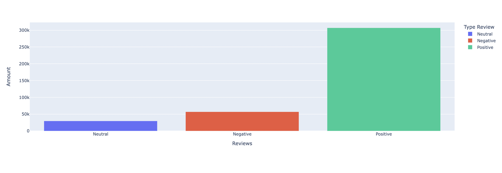
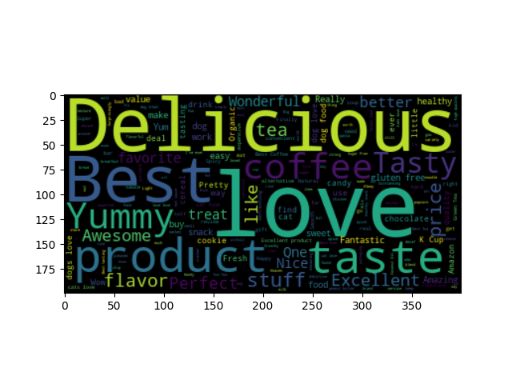
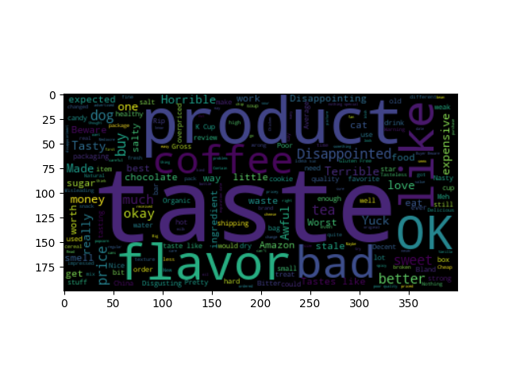
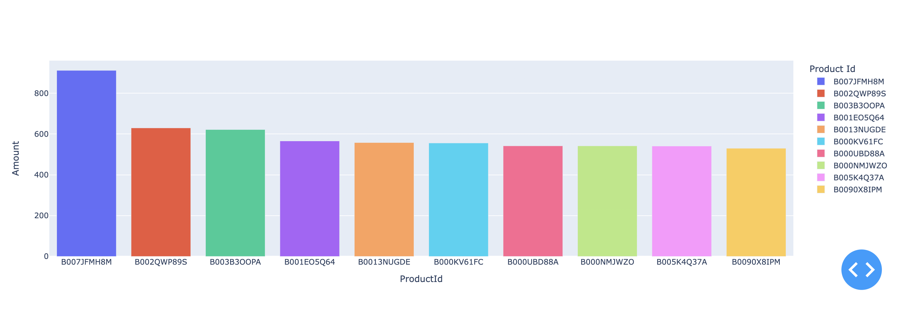
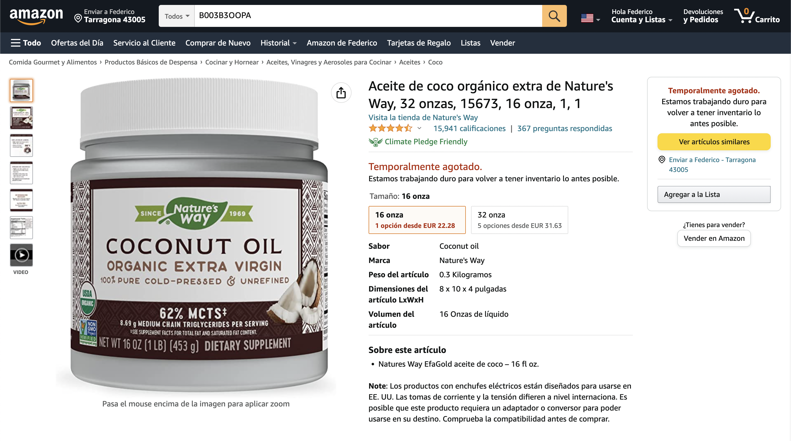

# Data Analytics

## Project Overview
* **Sentiment Analysis** to detect correlations between text polarity and review's score.
* **Classification** of positive and negative reviews based on the text of the review.
* **Aspect Based Sentiment Analysis** on product reviews to detect sentiments on different product's characteristics.

For this project we've taken a dataset from internet about food reviews, in this dataset we've differents attributes.

## Features

* **Id** of the review
* **ProductId** of the product reviewed
* **UserId** who makes the review
* **ProfileName** of the user
* **HelpfulnessNumerator** number of people who found the review helpful
* **Score** of the review
* **Time** date of the review
* **Summary**
* **Text** 

### Opinion Score over the time

In our case we made an analysis over the time, observing how the number of reviews increses with the time.

In this case we can see how at the start (around 2000-2001) there wasn't almost reviews, but with the past of the time every year we have more and more reviews, and always the one with most numbers are the reviews of 5 stars, we can see that the products are really good or we could also think that there are some sellers who try to fake their reviews to get better reviewss.

### Opinion Score

The opinion score graph:

It's easy to notice like we did before that the most reviews are positive. We've basically a 77,94% of positive reviews, 14,49% negative and 7,57% neutral reviews.

### Text review

The data contained in the text column is an unstructured text. Looking some of the words that we can see in the text, we can see easy if it's a negative or positive reviews.

Usually in negative reviews we can find often expressions as "disgusting" "don't like". In the other hand, for the positive reviews we can find expressions like "tasty", "enjoy", "recommended", "good price", etc.

A good way to distinguis negative and positive reviews is the frequency of the words, if we have some positive words with more frequency than negative words, probably it's gonna be a positive reviews. So after some frequencies calculations we can find the nexts results.

In the wordcloud above, some words that we can see are like "Delicious", "Love", "Best", "Tasty" and another that probably are from some product like "Coffee".

Let's look now at the words that tend to occur more often in negative reviews than in positive reviews.

There are several negative words, such as "disappointed". Again we find some words like "Coffee" probably about some product that some people didn't like it and it was coffee or maybe the taste.

## Data Preprocessing

In order to train the model, it is necessary to transform the reviews into the right format. We've made the following steps.
* Remove HTML tags
* Remove stopwords and punctuations
* Generate a Document Term Matrix (A mathematical matrix that describes the frequency of terms that occur in a collection of documents)

## Aspect Based Sentiment Analysis

In this section we study the Aspect Based Sentiment Analysis, in this case there's an analysis of the 10 products with more reviews in the dataset to perform the analysis.

This study particularly take into consideration the product with *productId* B003B3OOPA is one of the products with more reviews, the thirds to be exact.
The product in question is:

As we can see this product still today has a lot of reviews and a good average score. That's a good indicator that the reviews are valid.

------------------------
### LDA model
In natural language processing, the latent Dirichlet allocation (LDA) is a generative statistical model that allows sets of observations to be explained by unobserved groups that explain why some parts of the data are similar. For example, if observations are words collected into documents, it posits that each document is a mixture of a small number of topics and that each word's presence is attributable to one of the document's topics. LDA is an example of a topic model.

#### Optimal number of topics
To calculate the optimal number of topics, 10 different models are generated, each with the number of topics to be identified ranging from 1 to 10. For each model generated the topic coherence is calculated and the one with the highest topic coherence value is chosen.

In this case, the ideal topic number for this product is 6. The LDA model is then created by setting to 6 the parameter relative to the number of topics to search for in the text.

#### Topic Visualization

#### Sentiment of each topic

## Sentiment Analysis

## Review Classification

