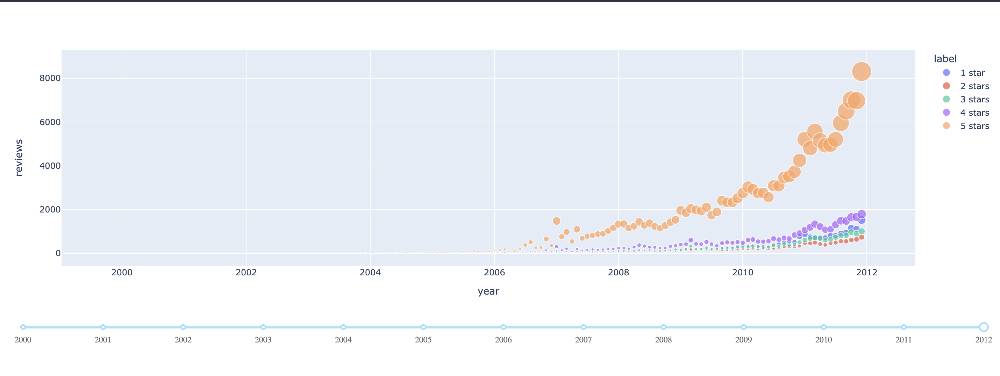

# Data Analytics

## Project Overview
* **Sentiment Analysis** to detect correlations between text polarity and review's score.
* **Classification** of positive and negative reviews based on the text of the review.
* **Aspect Based Sentiment Analysis** on product reviews to detect sentiments on different product's characteristics.

For this project we've taken a dataset from internet about food reviews, in this dataset we've differents attributes.

## Features

* **Id** of the review
* **ProductId** of the product reviewed
* **UserId** who makes the review
* **ProfileName** of the user
* **HelpfulnessNumerator** number of people who found the review helpful
* **Score** of the review
* **Time** date of the review
* **Summary**
* **Text** 

### Opinion Score over the time

In our case we made an analysis over the time, observing how the number of reviews increses with the time.

### Opinion Score

### Text review

## Data Preprocessing

## Aspect Based Sentiment Analysis

### LDA model

#### Optimal number of topics

#### Topic Visualization

#### Sentiment of each topic

## Sentiment Analysis

## Review Classification

